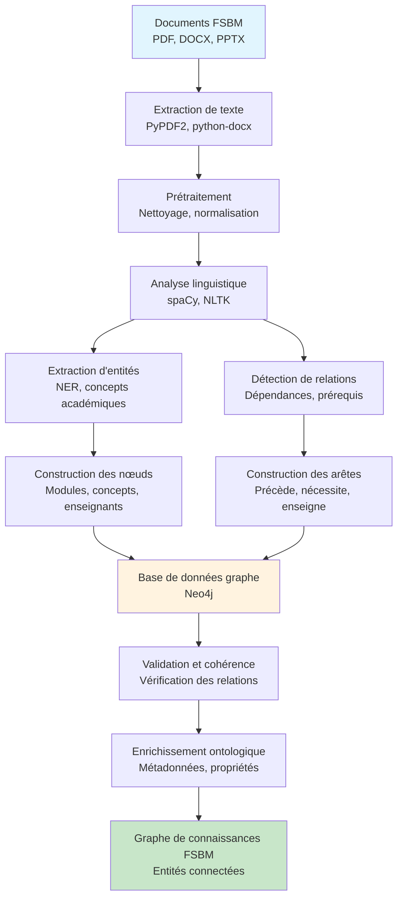
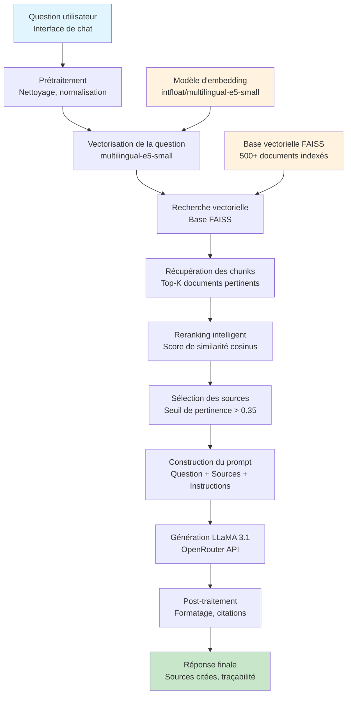
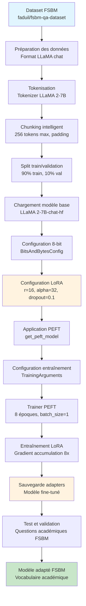
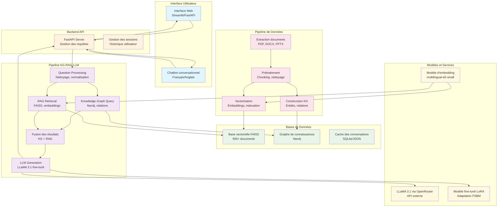
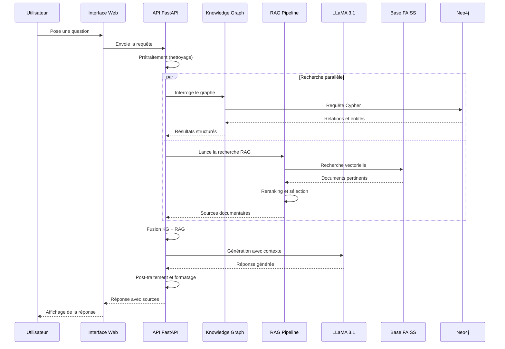
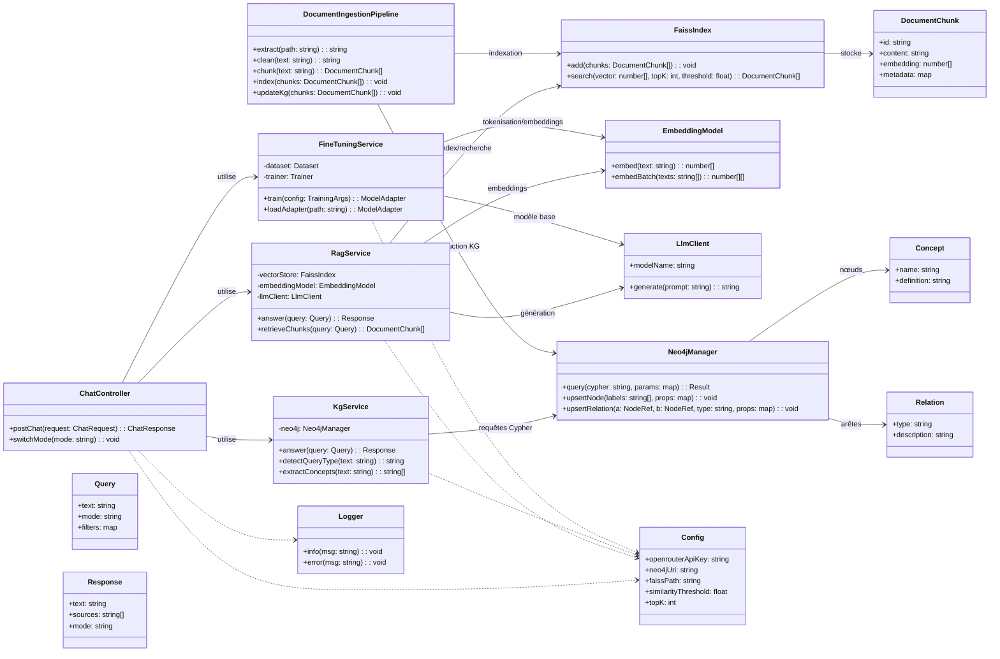

# Diagrammes Mermaid - Pipelines FSBM Scholar Assistant

## 1. Pipeline Graphes de Connaissances (Knowledge Graph)

## 2. Pipeline RAG (Retrieval Augmented Generation)

## 3. Pipeline Fine-tuning LLaMA avec LoRA

## 4. Architecture Globale du Système

## 5. Flux de Données Détaillé

---

## Description des Composants

### **Pipeline KG :**
- **Extraction** : Traitement des documents FSBM
- **Construction** : Création des nœuds et relations
- **Validation** : Vérification de la cohérence
- **Enrichissement** : Ajout de métadonnées

### **Pipeline RAG :**
- **Recherche** : Vectorisation et indexation FAISS
- **Récupération** : Sélection des documents pertinents
- **Génération** : LLaMA 3.1 avec contexte
- **Traçabilité** : Citations des sources

### **Pipeline Fine-tuning :**
- **Préparation** : Dataset académique FSBM
- **Configuration** : LoRA avec PEFT
- **Entraînement** : Adaptation ciblée
- **Validation** : Test sur questions académiques

### **Architecture Globale :**
- **Interface** : Chatbot conversationnel
- **Backend** : API FastAPI orchestratrice
- **Pipelines** : KG, RAG, LLM intégrés
- **Bases** : FAISS, Neo4j, cache
- **Modèles** : Embeddings, LLaMA fine-tuné

Ces diagrammes illustrent clairement la complexité et l'innovation de votre approche hybride KG-RAG-LLM ! 🚀

## 6. Diagramme de Classes (UML)

